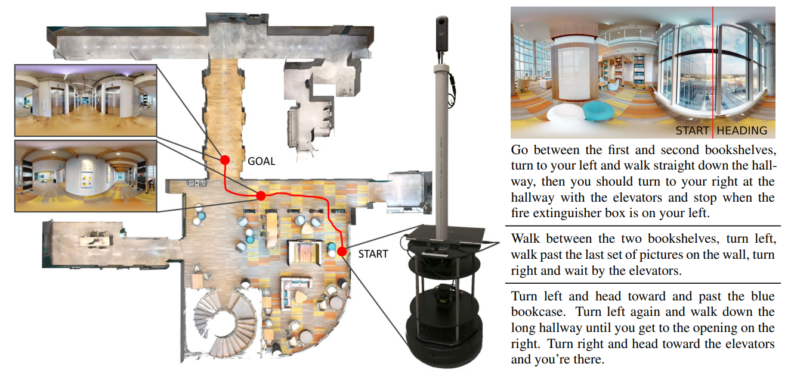

# vln-sim2real

Code for sim-to-real transfer of a pretrained [Vision-and-Language Navigation (VLN)](https://arxiv.org/abs/1711.07280) agent onto a [TurtleBot2](https://www.turtlebot.com/turtlebot2/) using [Robot Operating System (ROS)](http://wiki.ros.org/kinetic) and a learned subgoal model. We attempt natural language instruction-following using a physical robot placed in a previously unseen environment.



This repo contains code for running the robot. For code and utilities for digitizing and annotating a physical environment to create a parallel VLN simulator environment, see [vln-sim2real-envs](https://github.com/batra-mlp-lab/vln-sim2real-envs).

## Reference

A full description of this codebase and associated sim-to-real experiments and data can be found in the paper: [Sim-to-Real Transfer for Vision-and-Language Navigation](). If you use this code in your research, please cite our paper:

### Bibtex:
```
@inproceedings{vln-pano2real,
  title={Sim-to-Real Transfer for Vision-and-Language Navigation},
  author={Peter Anderson and Ayush Shrivastava and Joanne Truong and Arjun Majumdar and Devi Parikh and Dhruv Batra and Stefan Lee},
  booktitle={Conference on Robot Learning (CoRL)},
  year={2020}
}
```


## Prerequisites

### Hardware

Our experiments were performed using a [TurtleBot2](https://www.turtlebot.com/turtlebot2/) mobile robot consisting of a Kobuki mobile base, an Asus Xion Pro Live RGBD camera, and an ASUS netbook. To this setup we added a Hokuyo 2D laser scanner and a [Ricoh Theta V](https://us.ricoh-imaging.com/product/theta-v/) 360° RGB camera. Make sure that the RGBD camera and laser scanner transforms are set correctly with respect to the robot base. In our case, we modified the `kinect.urdf.xacro` and `turtlebot_common_library.urdf.xacro` files in the `turtlebot_description` package (the modified versions are saved in the `description` directory. 

Due to the limitations of the ASUS netbook, we also used a PC with an Nvidia gpu for off-board processing. However, with an Nvidia gpu on the TurtleBot and minor reconfiguration all processing could be performed on the robot.

### Software

- Ubuntu 16.04.6 LTS
- [ROS Kinetic](http://wiki.ros.org/kinetic)
- [PyTorch 1.1.0](https://pytorch.org/)
- Python 2.7

With minor, if any changes, this code should also work with Ubuntu 18.04 / ROS Melodic. However, upgrading to Python 3 may be more difficult as not all standard ROS packages are available. 


### Dockerfile

To simplify dependencies we provide the [Dockerfile](Dockerfile) that we used in experiments. To use the Dockerfile, install [docker](https://docs.docker.com/engine/installation/) and [nvidia-docker2.0](https://github.com/nvidia/nvidia-docker/wiki/Installation-(version-2.0)). All commands below should be run from the top-level directory of this repo.

To build the docker image:
```
docker build -t ros:9.2-devel-ubuntu16.04 .
```

To run the docker image (while enabling support for GUIs such as [rviz](http://wiki.ros.org/rviz)):
```
xhost +
nvidia-docker run -it --env="DISPLAY" --env="QT_X11_NO_MITSHM=1" --volume="/tmp/.X11-unix:/tmp/.X11-unix:rw" --network="host" --volume `pwd`:/root/mount/vln-pano2real-ros ros:9.2-devel-ubuntu16.04
cd /root/mount/vln-pano2real-ros
```

## Basic Setup

The following ROS packages are included in `src`:
- `theta`: Triggering and publishing images from the Ricoh Theta V camera.
- `vln_subgoals`: Predicting nearby waypoints or subgoals to provide to the VLN agent in the setting with no map or navigation graph.
- `vln_agent`: PyTorch code for the VLN agent (ported from [R2R-EnvDrop](https://github.com/airsplay/R2R-EnvDrop)).
- `vln_evaluation`: Issue instructions and evaluate the VLN agent via pose tracking and standard metrics such as success rate and SPL.

We assume some familiarity with ROS. After [installing ROS](http://wiki.ros.org/kinetic/Installation/Ubuntu) or building and running our Docker image, make sure the ROS environment variables are added to your bash session, e.g:
```
source /opt/ros/kinetic/setup.bash
```

To build the provided packages, run:
```
catkin_make
source devel/setup.bash
```

Typically you will have a PC to communicate with the robot (and optionally to run gpu-intensive ROS nodes). Make sure the robot and PC are on the same network and can ping each other. Suppose the robot IP is 128.61.117.147 and the remote PC has IP 143.215.119.70, then on the PC run:
```
export ROS_MASTER_URI=http://128.61.117.147:11311
export ROS_HOSTNAME=143.215.114.158
```

On the robot run:
```
export ROS_MASTER_URI=http://128.61.117.147:11311
export ROS_HOSTNAME=128.61.117.147
```

You may wish to add these environment variables to the robot and PC .bashrc files.


### VLN Agent Setup

The VLN agent used on the robot is the [R2R-EnvDrop](https://github.com/airsplay/R2R-EnvDrop) model trained on PyTorch ResNet-152 CNN features with color-jitter noise. On the PC, the agent model weights should be saved as `src/vln_agent/models/best_val_unseen.pth` (this default filepath is set in the `src/vln_agent/launch/agent_*.launch` files). Also, the weights for the subgoal prediction model need to be downloaded and saved on the PC as `src/vln_subgoals/models/BEST_CP_epoch18.pth`. 

To download our pretrained agent and subgoal models, run:
```
download_models.sh
```


### Occupancy Map Setup

The experiments require that an occupancy map of the environment is prebuilt in advance using the laser scanner. This is so we can localize the robot during experiments in order to accurately evaluate instruction following. The occupancy map for CODA is prebuilt and saved in `src/vln_agent/maps/coda.yaml` (for CODA, skip this section). To build this map for a **new** environment, follow these instructions. 

On the robot:
```
roslaunch vln_agent build_map.launch
```

On the PC:
```
roslaunch turtlebot_teleop keyboard_teleop.launch  # To drive the robot around while building the map
roslaunch turtlebot_rviz_launchers view_navigation.launch  # To see what's going on
```

On the robot:
```
rosrun map_server map_saver -f /tmp/my_map  # To save the map somewhere
```

Note: do not close the build_map.launch until after the map is saved.

## Running the On-Robot Instruction Evaluations

We provide [ROS launch files](http://wiki.ros.org/roslaunch) for various configurations, e.g. [running a demo](###basic-demo), evaluating the agent [with a map](###with-map-evaluation) or [without a map](###no-map-evaluation), etc. As described in the paper, we consider two evaluation scenarios:
- `With Map`: The robot has not been trained in the test environment, but it does have a pre-existing laser scan of the environment and a navigation graph. See [this section](###mapping-an-environment) to create a laser scan map.
- `No Map`: Strictest unseen environment setting. The robot builds a map using the [gmapping](http://wiki.ros.org/gmapping) SLAM package, but the map is wiped every time the robot receives a new instruction.
Note that the evaluation settings assume the robot is in CODA, and would need to be adapted with new maps and new instructions for evaluation in a different environment.

Before running any launch files, make sure a ROS master is running on the robot. This can be started by running:
```
roscore
```

In general each command mentioned below should be run in a separate terminal, on the PC or on the robot as indicated.

### With Map Evaluation

This will evaluate the robot in the physical CODA environment.

First, launch the sensors, navigation stack, mobile base, etc on the robot. The `record_data` arg is optional but essential if you want to generate evaluation metrics later. :
```
roslaunch vln_agent robot_wmap.launch record_data:=true
```

Launch the PyTorch nodes for the VLN agent on the PC:
```
roslaunch vln_agent agent_wmap.launch record_data:=true
```

Launch rviz on the PC to monitor the robot remotely (for fair sim-to-real comparison the robot should not see people during evaluation):
```
rosrun rviz rviz -d `rospack find vln_agent`/rviz/eval_navigation.rviz
```

Before proceeding, initialize the robot's pose correctly in rviz by clicking the `2D Pose Estimate` button, then left-click on the robot's location on the map in rviz and drag in the direction the robot is facing before releasing.

On either PC or robot, run the evaluation node that will load navigation instructions and issue them to the robot:
```
roslaunch vln_evaluation eval_wmap.launch
```

The robot will now complete the evaluation of 111 instructions, automatically navigating to the start of the nearest next instruction (in a greedy fashion) each time the previous episode ends. If the `record_data:=true` param was used, [Rosbag](http://wiki.ros.org/rosbag) files will be saved with the prefix `/tmp/vln-sim2real` on the robot and `/tmp/vln-sim2real-pc` on the PC. We suggest saving in both locations for safety. 

Note that there is a file `src/vln_evaluation/param/instruction_params.yaml` that is used to keep track of which instruction ids have already been completed, so ROS can be shutdown and restarted without having to begin the evaluation again from the start. This file also contains the ids of 9 CODA instructions that are excluded from the evaluation. The instructions to be evaluated are saved (in R2R format) in `src/vln_evaluation/data/R2R_coda.json`. These file locations are set in `src/vln_evaluation/launch/eval_wmap.launch`. 

To evaluate the resulting Rosbag files and generate standard R2R evaluation metrics, copy either the robot or PC bag files from `/tmp/` to `src/vln_evaluation/data/bags/wmap/` and run `python src/vln_evaluation/viz_paths.py` in the Docker image with ROS installed. This will generate some plots in `src/vln_evaluation/figs/`, save the robot's paths in R2R format to `src/vln_evaluation/data/bags/wmap/submit_coda_robot_wmap.json`, and print standard VLN evaluation metrics to the screen.


### No Map Evaluation

This setting needs a different configuration, since it requires running two ROS navigation stacks: one with a pre-existing map (for evaluation purposes), and a separate navigation stack running SLAM for the VLN agent (which must not have access to the pre-existing map). To achieve this, we run two ROS masters using the [multimaster_fkie](http://wiki.ros.org/multimaster_fkie) package.

On the robot:
```
roslaunch vln_agent robot_nomap.launch
```

On the PC, start the PyTorch nodes and rviz:
```
roslaunch vln_agent agent_nomap.launch
```
```
rosrun rviz rviz -d `rospack find vln_agent`/rviz/eval_navigation.rviz
```

For this setting only, in a new terminal on the robot start a *second ROS master* on a different port by running:
```
roscore -p 11312
```

This second ROS master will run the evaluation node with its own separate navigation stack using the pre-existing map. On the PC, launch a second rviz instance connected to this master so that the robot's true location can be visualized and recorded:
```
export ROS_MASTER_URI=http://128.61.117.147:11312
roslaunch vln_evaluation pc_nomap.launch record_data:=true
rosrun rviz rviz -d `rospack find vln_agent`/rviz/eval_navigation_multimaster.rviz
```

On the robot, launch the evaluation using the second ROS master:
```
export ROS_MASTER_URI=http://128.61.117.147:11312
roslaunch vln_evaluation eval_nomap.launch record_data:=true
```

As with the with-map setting, the robot will now complete the evaluation of 111 instructions, automatically navigating between episodes. You can observe the robot building a SLAM map in the first rviz window (which is wiped at the beginning of each episode), while in the second rviz window the robot's tracked location in the map can be observed. [Rosbag](http://wiki.ros.org/rosbag) files will be saved with the prefix `/tmp/vln-sim2real-nomap` on the robot and `/tmp/vln-sim2real-nomap-pc` on the PC. 

As in the with map setting, the script `src/vln_evaluation/viz_paths.py` can be used to process the bag files and generate evaluation metrics. 

## License

The Matterport3D dataset is governed by the
[Matterport3D Terms of Use](http://kaldir.vc.in.tum.de/matterport/MP_TOS.pdf).
This code is released under the BSD 3-Clause license.
